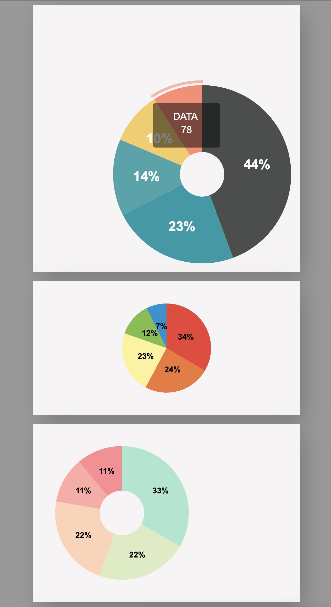

# $$\mathcal{\color{lightblue}{SVG-Charts}}$$
___
```diff
❗️ work in progress ❗️
```



This is the first attempt to create reusable charts using SVG-Elements.

Currently there are pieCharts - but not yet dynamic. Also no other legend than showing percentage of slices.
Each pie-chart got its own background with own dimension-properties and can be freely placed on that "canvas".

The charts get created by passing a data-obj including data and chart-properties to a function.

The usage is shown by the 3 examples in `index.js`.

As I tend to first get the logic-part running, I then need to restructure things to create a user-friendly API...


___
### Any ideas or contributions would be highly appreciated!


